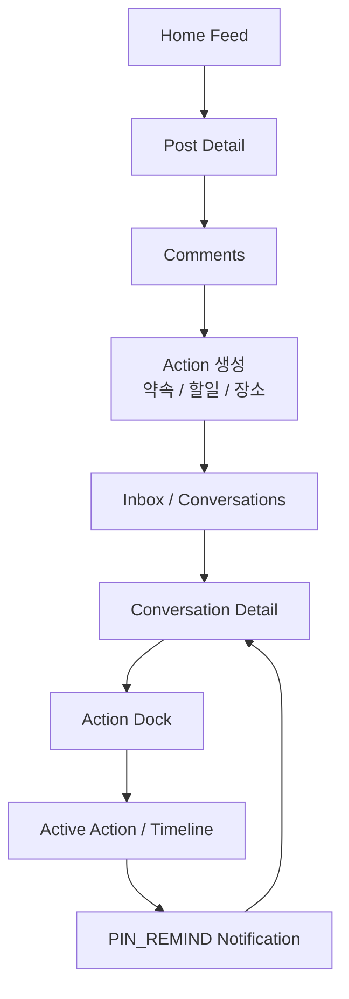
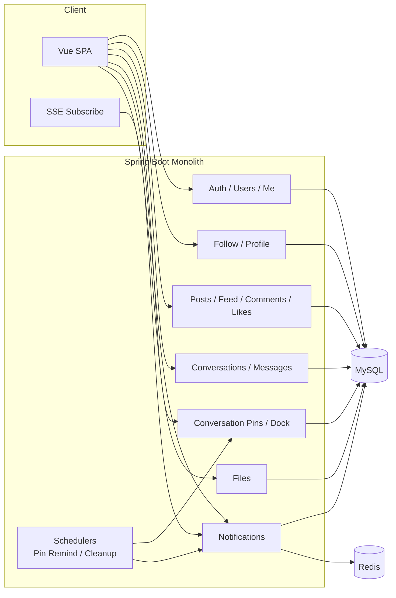

# RealLife Service Architecture

RealLife는 단순 SNS나 단순 메신저가 아니라 **피드/댓글 → 대화 → 액션 → 실제 일정/할일/장소**로 이어지는 서비스입니다.

## 1. 핵심 제품 흐름

## 2. 백엔드 모듈 구조

## 3. 데이터/이벤트 흐름

### 3-1. 공개 피드
- `ALL` : 누구에게나 노출
- `FOLLOWERS` : 작성자를 팔로우한 사용자 + 작성자 본인에게 노출
- `PRIVATE` : 작성자 본인만 노출

### 3-2. 댓글 → 액션 → 채팅
1. 사용자가 댓글/대화에서 일정성 문장을 남김
2. 프론트가 action bridge로 대화 화면에 전달
3. Conversation Detail에서 Pin 후보를 Dock에 제안
4. 저장되면 `conversation_pins`에 ACTIVE 상태로 보관

### 3-3. Action Reminder
1. 핀 생성 시 `start_at`, `remind_at` 저장
2. `ConversationPinRemindScheduler`가 매분 due pin 조회
3. 참여자 모두에게 `PIN_REMIND` Notification 생성
4. SSE `notification-created` 이벤트로 프론트 갱신

## 4. 현재 완성된 축
- 회원가입 / 로그인 / 쿠키 인증
- 프로필 / 팔로우
- 피드 / 게시글 / 댓글 / 좋아요
- 대화 / 메시지 / 읽음 처리
- Action Dock / Timeline
- SSE 알림 / PIN_REMIND

## 5. 다음 우선순위
1. 프로필 편집 / 유저 프로필 완성
2. Feed 공유 강화 (액션 완료 후 공유)
3. Action Map
4. Chat UX (typing indicator, read receipt polish)
